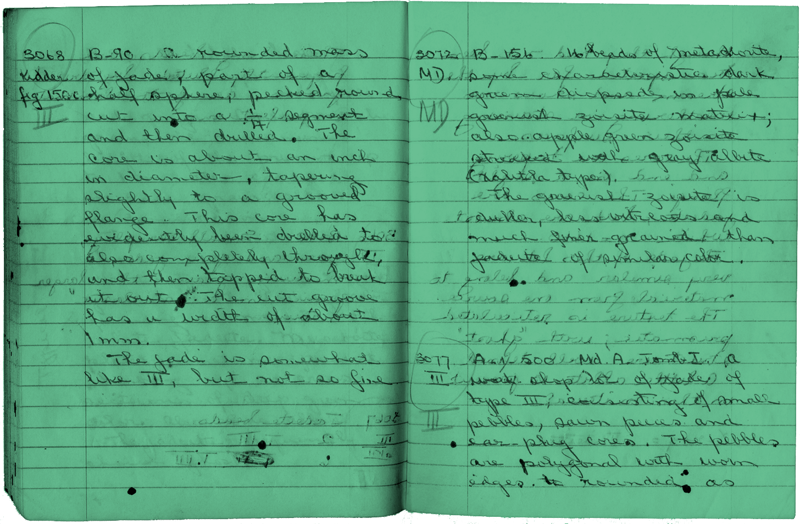

<!-- [](https://github.com/kennethormandy/a-record)

*** -->

# A Record

Share specific help for adding DNS Records to a domain.

## Getting started

To add A Record to your project’s dependencies, install it with [npm](http://npmjs.org):

```sh
npm install --save a-record
```

Now, you can require it and within you application:

```js
var hosts = require("a-record");
```

From here, you might pass the data along to your templates so you can iterate through the entire list:

```jade
ul
  each host in hosts
    li: a(href="#{ host.arecord }") Add an A Record using #{ host.name }
    li: a(href="#{ host.cname }")   Add a CNAME using #{ host.name }
```

Or, provide specific instructions if you already know the nameserver:

```
console.log('Get help at: ' + host['namecheap.com'].arecord);
// Get help at http://www.namecheap.com/support/knowledgebase/article.aspx/319/78/
```

## License

[The MIT License (MIT)](LICENSE.md)

Copyright © 2015 [Kenneth Ormandy](http://kennethormandy.com) & [Chloi Inc.](http://chloi.io)
